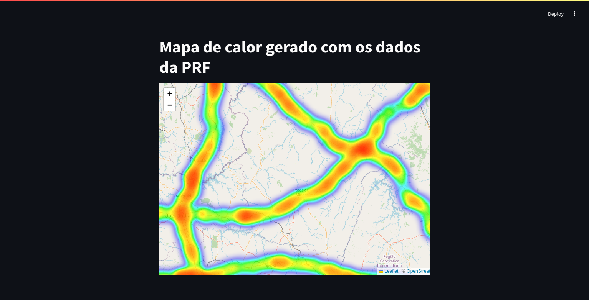
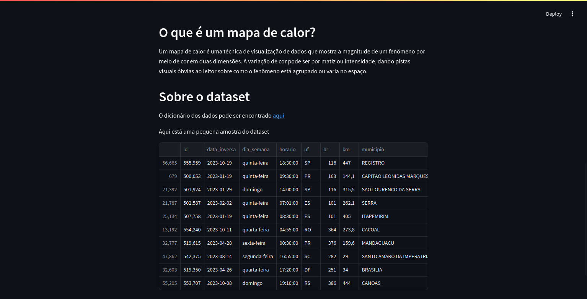

# PRF Geographic Heatmap

Mapa de calor interativo baseado em dados abertos da PRF sobre acidentes.



## Para iniciar o projeto

1. Instale as dependências no projeto

```bash
poetry install
```

2. Ative o ambiente virtual

```bash
eval $(poetry env activate)
```

3. Execute a aplicação pelo **streamlit**

```bash
streamlit run prf_geographic_heatmap/main.py
```